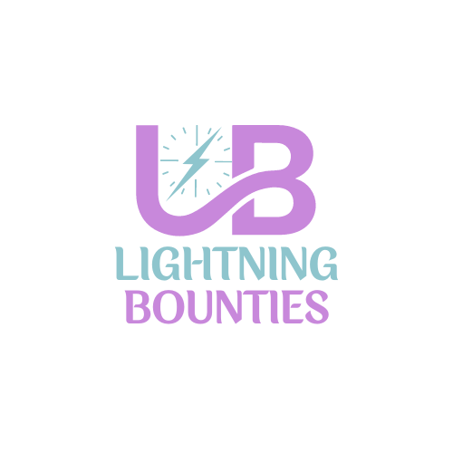

<a id="readme-top"></a>


<details> <summary>Project Checklist</summary>
  
- [x] Banner Image or Logo
- [x] 1 Paragraph Charter on what we are all about 
- [x] Links or Badges to Socials: Twitter, Documentation, Website, Blog, YouTube?
- [ ] Table of contents toggle
- [ ] Getting Started/contributing guide 
- [ ] hyperlink to scroll on table of contents
- [ ] back to the top markers/badge  
- [ ] Tech Stack, Python, Next.js, Typescript, JWT, 
- [x] Built With: Branta, Gitbook,
- [ ] Formatting / Order
- [ ]
- [ ]
- [ ]
- [ ]
- [ ]
### MISQ Pages 
- [ ] Roadmap in mermaid
- [ ] Engineering Diagrahm workflow?
- [ ] Buy me a coffee?
- [ ] Pull request template?
- [ ] 
</details>

<br />

<div align="center" style="display: flex; flex-wrap: wrap; justify-content: center; gap: 20px; border: 2px solid #4285f4; padding: 20px; border-radius: 10px;">

  <a href="mailto:founders@lightningbounties.com" target="_blank">
    
  </a>
  <a href="https://https://x.com/LBounties" target="_blank">
    
  </a> 
  <a href="https://docs.lightningbounties.com" target="_blank">
    
  </a>
   <a href="https://www.youtube.com/@LightningBounties" target="_blank">
    
  </a>
  
  <a href="https://blog.lightningbounties.com" target="_blank">
    
  </a>

  <a href="https://app.lightningbounties.com" target="_blank">
    
  </a>
</div>

<div align="center">
  <h1>Welcome to</h1>
  <a href="https://github.com/othneildrew/Best-README-Template">
    
  </a>
    <details> <summary>About</summary>
      <div align="start">
      <p> In the current landscape, many open-source bug bounty platforms inadvertently shut out developers from regions outside the USA and EU, creating barriers to participation and diversity. To address this, Lightning Bounties is revolutionizing open-source development by integrating Bitcoin payments directly into GitHub. This approach aligns with the core principles of the open-source software and Bitcoin movements—decentralization, transparency, and inclusivity—by offering seamless and instantaneous financial rewards to developers globally. By leveraging the Bitcoin Lightning Network, Lightning Bounties ensures that contributions to open-source projects are directly rewarded, fostering a sustainable and thriving community where developers can easily receive compensation for their valuable work </p>
      </div>
  </details>
<details>
  
<summary>How to Contribute</summary>
<div align="start">
  <h2>🚀 How to Contribute</h2>

1. **Find an open bounty** on our [bounty platform](https://app.lightningbounties.com) or in the [Issues tab](https://github.com/Lightning-Bounties/docs/issues).
2. **Fork this repository** and create a new branch for your work.
3. **Make your changes** and commit them with clear, concise commit messages.
4. **Submit a Pull Request** with a detailed description of your changes.
5. **Get paid in SATs** once your PR is reviewed and merged!

***For a full guide on our contribution process,*** please check our [Contribution Guidelines](about-lb/contributing.md).
</div>
</details>
<details>

<summary>Why Contribute?</summary>
<div align="start">
  <h2>⭐Why Contribute? </h2>
  
- **Earn Bitcoin**: Get paid in sats for your valuable contributions.
- **Learn**: Dive deep into Open-Source, Bitcoin, & Lightning Network technologies and uncover the future of money and decentralized tech.
- **Accelerate Bug Fixes**: Collaborate with talented security researchers to speed up bug fixes, saving newbie coders valuable time.
- **Join the Community**: Become part of the vibrant Open-Source Movement and build the future you want to see.
</div>
</details>

  <details> <summary>Follow Us</summary>
    <div align="center" style="display: flex; flex-wrap: wrap; justify-content: center; gap: 20px; border: 2px solid #4285f4; padding: 20px; border-radius: 10px;">

  <a href="mailto:founders@lightningbounties.com" target="_blank">
    
  </a>
  <a href="https://https://x.com/LBounties" target="_blank">
    
  </a> 
  <a href="https://docs.lightningbounties.com" target="_blank">
    
  </a>
   <a href="https://www.youtube.com/@LightningBounties" target="_blank">
    
  </a>
  
  <a href="https://blog.lightningbounties.com" target="_blank">
    
  </a>

  <a href="https://app.lightningbounties.com" target="_blank">
    
  </a>
</div>
    </details>

  <details> <summary>Socials</summary>
        <div align="center" style="display: flex; flex-wrap: wrap; justify-content: center; gap: 20px; border: 2px solid #4285f4; padding: 20px; border-radius: 10px;">
### Welcome to The Lightning Bounties Social Accounts!

Connect with us and stay up-to-date. Engage through direct communication, code exploration, or social media on our various platforms.


<table><thead><tr><th width="200" align="center">Social Account</th><th align="center">Purpose</th></tr></thead><tbody><tr><td align="center">  <a href="https://www.lightningbounties.com/">Website </a></td><td align="center">Visit our website to learn more about Lightning Bounties, view our blog, sign up for our waitlist, and track our progress. </td></tr><tr><td align="center"><a href="https://app.lightningbounties.com/">Bounty Platform</a></td><td align="center">Interested in earning some Bitcoin? Go to our Bug Bounty Platform and Start Solving Bounties. New bounties are posted daily.</td></tr><tr><td align="center"><a href="https://github.com/MIT-Bitcoin-2024"> GitHub</a></td><td align="center">Explore our GitHub repo to access our platform's source code, contribute improvements, and review reported issues.</td></tr><tr><td align="center"> <a href="https://x.com/LBounties">Twitter </a></td><td align="center">Follow us on Twitter to stay updated with real-time program announcements, news, and important information.</td></tr><tr><td align="center">  <a href="https://t.me/+vEnFunP_mfRjOTJh">Telegram </a></td><td align="center">Join our Telegram group to connect with us directly.</td></tr><tr><td align="center"> <a href="https://youtube.com/@lightningbounties?si=AGCT8Zqazy1IUDaX">YouTube</a></td><td align="center">Subscribe to our YouTube channel to access educational videos, and learn through our in-depth tutorials. </td></tr><tr><td align="center">  <a href="mailto:founders@lightningbounties.com">Email</a></td><td align="center">For inquiries, feedback, or collaboration opportunities, please email us. Our team will gladly assist you.</td></tr></tbody></table>
</div>
    </details>


  <p>
    <a href="https://docs.lightningbounties.com"><strong>Explore the docs »</strong></a>
  </p>
  <p>
    <a href="https://github.com/othneildrew/Best-README-Template">View Demo</a>·
    <a href="https://github.com/othneildrew/Best-README-Template/issues/new?labels=bug&template=bug-report---.md">Report Bug</a>
    ·
    <a href="https://github.com/othneildrew/Best-README-Template/issues/new?labels=enhancement&template=feature-request---.md">Request Feature</a>
  </p>
</div>


<!-- TABLE OF CONTENTS -->
<details>
  <summary>Table of Contents</summary>
  <ol>
    <li>
      <a href="#about-the-project">About The Project</a>
      <ul>
        <li><a href="#built-with">Built With</a></li>
      </ul>
    </li>
    <li>
      <a href="#getting-started">Getting Started</a>
      <ul>
        <li><a href="#prerequisites">Prerequisites</a></li>
        <li><a href="#installation">Installation</a></li>
      </ul>
    </li>
    <li><a href="#usage">Usage</a></li>
    <li><a href="#roadmap">Roadmap</a></li>
    <li><a href="#contributing">Contributing</a></li>
    <li><a href="#license">License</a></li>
    <li><a href="#contact">Contact</a></li>
    <li><a href="#acknowledgments">Acknowledgments</a></li>
  </ol>
</details>


## Getting Started
 
### Installation

Below is an example of how you can instruct your audience on installing and setting up your app. 

1. Clone the repo
   ```sh
   git clone https://github.com/Lightning-Bounties/lb-next
   ```
2. Install NPM packages
   ```sh
   npm install
   ```
3. Env Vars: <em> edit as needed </em>
   ```sh
   cp .env.local.example .env.local
   ```
4. Config Files: <em> edit as needed </em>
   ```js
   tsconfig.json
   ```  
5. Run Dev Server
   ```sh
   npm run dev
   ```
6.  Grab a JWT token from the production backend and add it to your local storage under the dev server domain.
    - see documents for instructions and video [here](https://docs.lightningbounties.com/docs/solve-a-bounty/working-on-opensource-frontend-lb-next).
      
7.  Change git remote url to avoid accidental pushes to base project
   ```sh
   git remote set-url origin github_username/repo_name
   git remote -v # confirm the changes
   ```

<p align="right">(<a href="#readme-top">back to top</a>)</p>

## Learn More

<div align="center" style="display: flex; flex-wrap: wrap; justify-content: center; gap: 20px; border: 2px solid #4285f4; padding: 20px; border-radius: 10px;">

  <a href="mailto:founders@lightningbounties.com" target="_blank">
    
  </a>
  <a href="https://https://x.com/LBounties" target="_blank">
    
  </a> 
  <a href="https://docs.lightningbounties.com" target="_blank">
    
  </a>
   <a href="https://www.youtube.com/@LightningBounties" target="_blank">
    
  </a>
  
  <a href="https://blog.lightningbounties.com" target="_blank">
    
  </a>

  <a href="https://app.lightningbounties.com" target="_blank">
    
  </a>
</div>
<p align="right">(<a href="#readme-top">back to top</a>)</p>

## Top contributors: 

<a href="https://github.com/Lightning-Bounties/lb-next/graphs/contributors">
  
</a>

<p align="right">(<a href="#readme-top">back to top</a>)</p>

<div align="center">

<h2><span> Special Thanks </span></h2>      
<div align="center">

| <h3><a href="https://branta.pro">Branta</a></h3> | <h3><a href="https://www.gitbook.com">GitBook</a></h3> | <h3><a href="https://www.pleblab.dev/">PlebLab</h3> |
|:-------:|:-------:|:--------------------:|
|  |  |  |
| <p align="center" width="240">Branta offers payment verification <br>for various bitcoin and lightning technologies.</p> | <p align="center" width="240">GitBook: Documentation platform<br>for teams to share knowledge</p> | <p align="center" width="240">PlebLab is founder-led and founder-focused, <br>providing resources and mentorship to drive<br>impactful Bitcoin companies since 2021.</p> |

</div>
<p align="right">(<a href="#readme-top">back to top</a>)</p>


# Other Assets Delete Later 


# Built With 


Fix branta logo  


# Socials 


  <a href="https://www.linkedin.com/in/michael-abramo/" target="_blank">
    
  </a>


